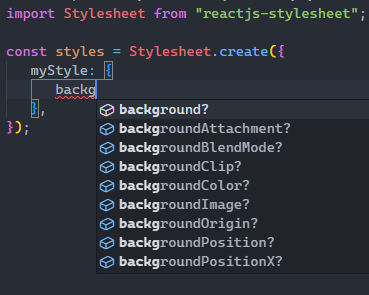

# reactjs-stylesheet
## A more intuitive way to write jsx style in reactjs

[](https://travis-ci.org/joemccann/dillinger)

reactjs-stylesheet is a package that simplifies the way you can write your style for react components in javascript. It takes inspiration from react-native Stylesheet and adds some extra features.
### Combine javascript and CSS, Features:
- Stylesheets with intellisense support in Visual Studio Code, no more style-name guessing!
- easy and reliable theme handling: now you can switch between all the themes you defined and change the colors of your site

## Intellisense support


## Installation
Required [Node.js](https://nodejs.org/) v10+ to run.
```sh
npm i reactjs-stylesheet
```

## Quick start
In styles.ts or styles.js:
```js
import Stylesheet from "reactjs-stylesheet";
const styles = Stylesheet.create({
	container: {
		backgroundColor: "#81D4FA",
		color: "#263238",
		height: "100px",
	},
	button: {
		backgroundColor: "#039BE5",
		borderRadius: "5px",
		cursor: "pointer",
	},
	textDiv: {
		backgroundColor: "#64B5F6",
		width: "180px",
	},
});
export default styles;
```
In index.ts, or index.js:
```js
import React, { useState } from "react";
import styles from "./styles";

const MyComponent = () => {
	const [theme, setTheme] = useState("light");
	return (
		<div style={styles.container}>
			<div>
				<button
					style={styles.button}
					onClick={() => {
						alert("clicked");
					}}
				>
					Styled button
				</button>
				<div style={styles.textDiv}>
					Styled with <br /> reactjs-stylesheet!
				</div>
			</div>
		</div>
	);
};

export default MyComponent;
```

# Theme handling
## Basic usage inside a component
```js
import React, { useState } from "react";
import Stylesheet from "reactjs-stylesheet";
const themes: {
	[themeName: string]: {
		[key: string]: string;
	};
} = {
	light: {
		primary: "#E3F2FD",
		secondary: "#64B5F6",
	},
	dark: {
		primary: "#ECEFF1",
		secondary: "#90A4AE",
	},
};
const MyComponent = () => {
	const [theme, setTheme] = useState("light");
	const styles = Stylesheet.createWithTheme(themes[theme], (colors) => {
		return {
			container: {
				backgroundColor: colors.background,
				color: colors.textColor,
			},
			button: {
				backgroundColor: colors.touchable,
			},
			text: {
				backgroundColor: colors.secondary,
				color: colors.textColor,
			},
		};
	});
	return <div style={styles.container}>myComponent</div>;
};
```
## Advanced usage in a separate style module
In styles.ts or styles.js:
```js
import Stylesheet from "reactjs-stylesheet";
import { Colors } from "reactjs-stylesheet/lib/types";
const getStyles = (colors: Colors) => {
	//return the styles you want to use
	return Stylesheet.createWithTheme(colors, (colors) => {
		return {
			container: {
				backgroundColor: colors.background,
				color: colors.textColor,
			},
			button: {
				backgroundColor: colors.touchable,
			},
			text: {
				backgroundColor: colors.secondary,
				color: colors.textColor,
			},
		};
	});
};
export default getStyles;
```
In index.ts, or index.js:
```js
//in index.ts (or .js)
import React, { useState } from "react";
import getStyles from "./styles";
const themes: {
	[themeName: string]: {
		[key: string]: string;
	};
} = {
	light: {
		primary: "#E3F2FD",
		secondary: "#64B5F6",
	},
	dark: {
		primary: "#ECEFF1",
		secondary: "#90A4AE",
	},
};
const MyComponent = () => {
	const [theme, setTheme] = useState("light");
	const styles = getStyles(themes[theme]);
	return <div style={styles.container}>myComponent</div>;
};
export default MyComponent;
```


## License

MIT
**Free Software, try it out!**